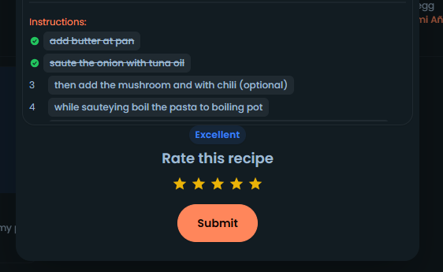

# RECIPE Web Application

Users can post there own recipe and chat with each other. They can also manage the recipe they posted, and other users or the chefs can rate it.

# TECH USED:

Backend: FIREBASE
Front-end: VUE.JS, TAILWINDCSS, DAISYUI

# FEATURES:

Chat
Filter
Search
CRUD Operations
Ratings
Realtime Data

# PROJECT IMAGES

# Home

# Add Modal

# Chat Modal

# Chat Box Modal

# Record Voice

# View Voice Record

# Recipe Modal

# Rate

# Edit Modal

# Delete Modal

# Logout Modal

